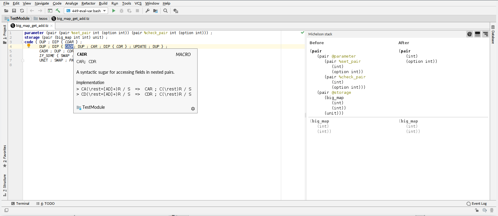
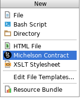
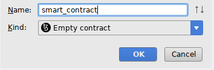
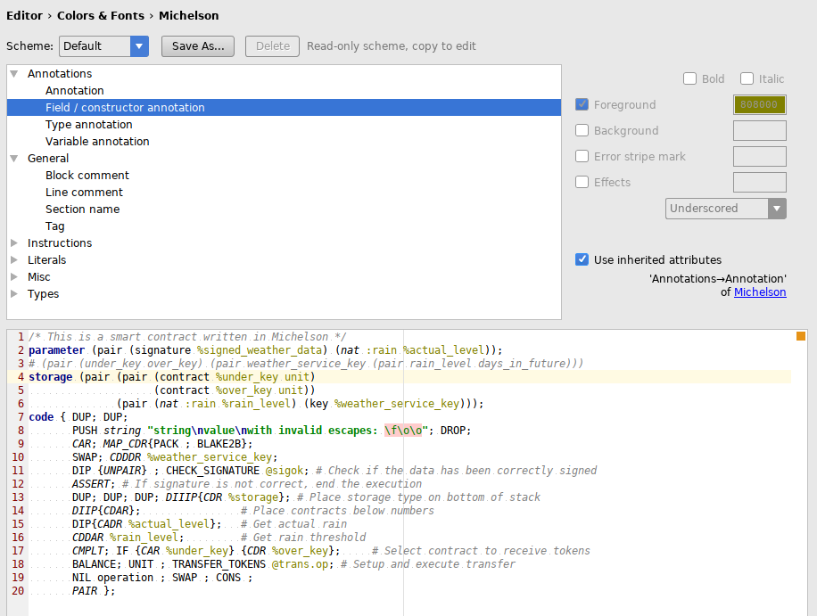
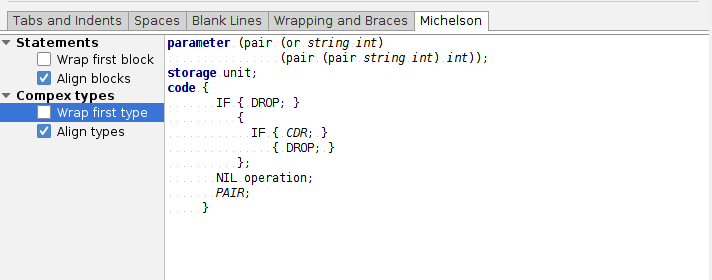
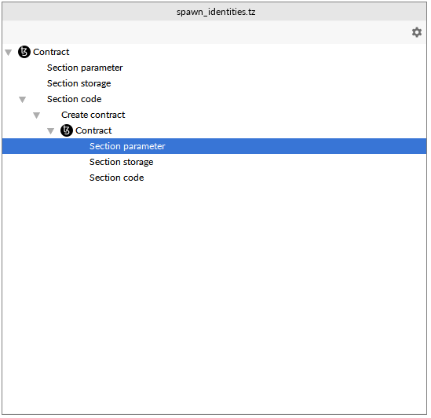
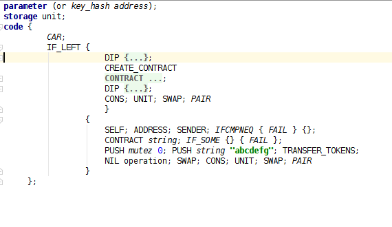

# IntelliJ support for the Tezos plaform

IntelliJ support for the Tezos platform.
This plugin adds support of technologies and languages used by the
Tezos platform to the IntelliJ products.

**Please beware that this is a very early release. A lot of features will be added in the future.**

## Reporting issues and whishes
Please use GitHub's issues to report any issue your uncover. Please free to
suggest features and possible extensions there as well.

## Compatibility

This plugin is compatible with versions 2016.1 (builds 145.x) and later.
This includes:
- IntelliJ
- PyCharm
- PhpStorm
- RubyMine

## Michelson

Michelson is a programing language used to write smart contracts.
See [the whitepaper](http://tezos.gitlab.io/betanet/whitedoc/michelson.html#) for all the details.

### File types
This plugins maps `*.tz` to the new Michelson file type.

### File templates

You can create a new file using the built-in functionality:

There are basic templates included to create an empty contract:

### Syntax highlighting

Syntax errors are highlighted:
- illegal escape characters used in strings
- unknown instruction
- unexpected arguments passed to instructions
- unexpected number of code blocks passed to instructions, e.g. `IF {} {} {}` or `IF {}`
- comparable type not used where expected
- unknown types
- unknown data values
- unexpected annotations, i.e. highlighting where an annotation wasn't expected
- unexpected number of annotations (type, variable and field annotations)

All syntax elements are configurable in the editor's color scheme settings.
Macro and instructions are highlighted differently.

### Code style & formatting

Some of the built-in code style settings are applied to Michelson files.
These are:
- Keep blank lines in code
- Keep blank lines before right braces
- Space withing parentheses
- Space before semicolon
- Space after semicolon

A few options which are specific to Michelson are available:
- Align blocks of statements
- Align line comments in blocks
- Align types of complex types
- Align annotations of complex types
- Warp first block of statements
- Wrap first type of complex types

### Structure view
There's basic support for structure view of Michelson files.

### Code folding
Blocks of instructions are folded into `{...}` and contracts inside of `CREATE_CONTRACT` are folded into `{CONTRACT ...}`.

### Live templates
The following live templates are available:
- `contract`: Available at top-level of an michelson file. Insert an empty contract at the position of the caret.

# License
This software is licensed under the BSD-3-clause license, see LICENSE.txt for details.

This repository contains script files at `src/test/data/contracts/tezos-repo/`
which were obtained at https://gitlab.com/tezos/tezos and which are under the MIT license.

# Links
- [Tezos](https://tezos.com/)
- [Tezos foundation](http://tezosfoundation.ch/)
- [Michelson language whitepaper](http://tezos.gitlab.io/betanet/whitedoc/michelson.html)